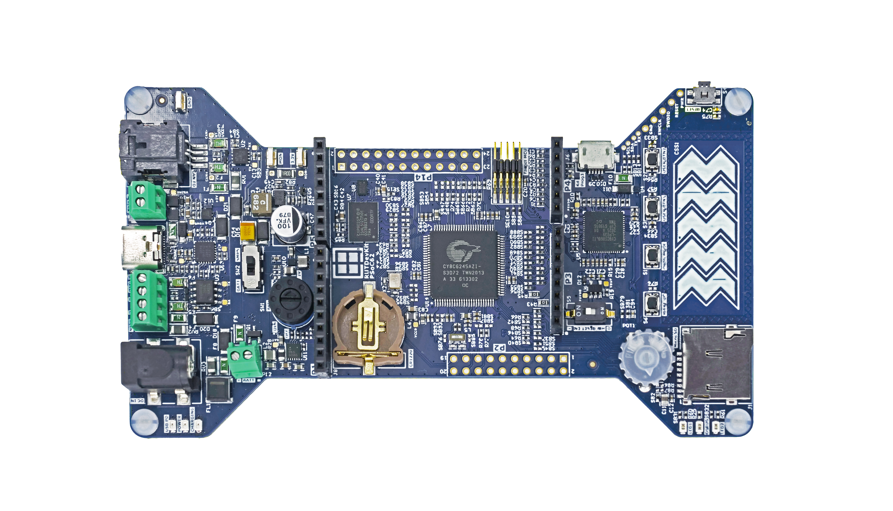

# RDK2 BSP

## Overview

First choice for the RDK2 was Infineon’s microcontroller PSoC™ 62. It is built on an ultra-low-power platform (40-nm) and combines an Arm® Cortex™-M4 and Arm Cortex-M0+ CPUs with low-power Flash technology, programmable digital and analogue resources, and offers high-performing CAPSENSE™ technology. Built around the PSoC™ 62 are the best-fitting standard components.

## Features

| Features:               | **Description:**                                             |
| ----------------------- | ------------------------------------------------------------ |
| DC Connector:           | 5.5X2.1mm ADAM TECH ADC-028-1-T/R-PA10T connector providing power to the whole board. 6V to 20V DC is applicable. |
| RS485 Terminal:         | RS485 is a common communications interface in industrial environments, equipped with a SP3078EEN-L/TR driver from MaxLinear. |
| Li-ION Charger:         | nPM1100 from Nordic Semiconductor. A very common charger used for designing IoT and other portable devices. |
| Rotary Switch:          | Compact, versatile switch from C&K for power-source selection. Especially convenient when selecting a single option from up to seven inputs is needed. |
| CR1220 Battery Socket:  | The Keystone CR1220 coin battery holder enables developers to have the whole system running at low power from a coin battery or simply keeps the RTC Clock powered when the MCU is shut down. |
| CY8C6245AZI-S3D72:      | Ultra-low-power high-performance microcontroller.            |
| Arduino RESET Switch:   | The DIP switch on the DIPTRONICS enables disconnecting the RESET signal from the Arduino socket. This is necessary in some cases because offline shields may interfere with the RESET signal, preventing the microcontroller from starting up. |
| Potentiometer:          | Tiny but useful potentiometer-trimmer with a knob from PIHER. It is used to test the ADC peripheral or even to adjust the mounted Arduino shield. |
| Micro SD Card Socket:   | High-quality ADAM TECH socket for continuous data logging or for removable/portable storage of large amounts of data. |
| USB Type-C:             | Comes with onboard stand-alone power delivery controller CYPD3177 from Infineon and Type-C connector from JAE. Enhances power supply options for the development platform. Also serves as an innovative demonstration purpose for particular clients who need to remove barrel DC connectors from existing designs. |
| Sink Output Terminal:   | A small terminal connector from SAURO connects a load to the power source via a USB Type-C connector. |
| CAN FD Terminal:        | The Minitek MicrospaceTM connector, in combination with the CAN FD driver TLE9251VLE and the PSoC™ 6245 controller with integrated CAN FD peripheral, provides a development-ready solution for CAN/CAN FD applications. |
| Current Monitor:        | Test point contacts from Keystone enable current measurement using an oscilloscope or multimeter. For ultra-low-power applications, additional specialised equipment is available. |
| SEMPER™ NOR Flash :     | A 512Mbit SEMPER™ NOR Flash connected via a microcontroller's QSPI can be used to store large amounts of program data, or even the firmware that may run directly from it. |
| PSRAM:                  | The AP Memory APS6404L-3SQR-ZR PSRAM is connected to a microcontroller via a QSPI interface and is designed for applications that require large amounts of RAM, with low power consumption in mind. |
| 10-pin ARM SWD:         | An Amphenol connector is used to connect third-party debuggers, such as J-Link. |
| KitProg3 via Micro USB: | The ADAM TECH micro USB connector is used to interface the KitProg3 on-board debugger. The KitProg3 Debugger is based on a CY8C5868LTI-LP039 microcontroller. |
| CAPSENSE™:              | Highlighted the superior feature of the PSoC™ MCUs.          |
| The Buttons:            | High-quality and durable Al buttons from Panasonic.          |
| The Power Management:   | Based on Diodes and ROHM products. The ROHM Buck/Boost BD83070GWL-E2 controller enables the board to be powered from the Li-ION battery. The Diodes AP63357DV-7 Buck high-efficiency controller allows having a high-power supply, providing developers with up to 3.5A of current at 5V. |

## Legal Disclaimer

The evaluation board including the software is for testing purposes only and, because it has limited functions and limited resilience, is not suitable for permanent use under real conditions. If the evaluation board is nevertheless used under real conditions, this is done at one’s responsibility; any liability of Rutronik is insofar excluded. 

